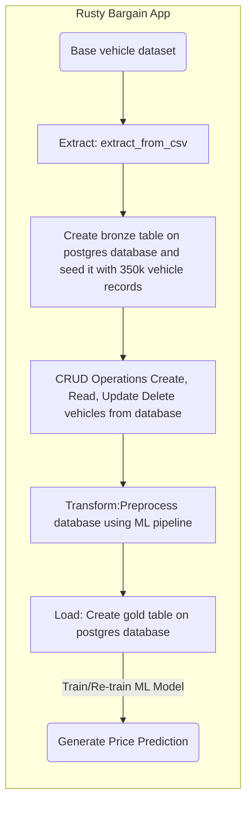

# Rusty Bargain App Documentation

## Overview

The **Rusty Bargain App** is a full-stack application designed to assist users in managing a vehicle database and predicting vehicle prices using machine learning models. This application is ideal for businesses and users who want to maintain a structured database and perform predictive analytics for vehicle pricing.

---

## Features

1. **Vehicle Database Management**:
   - View, add, update, and delete vehicle records.
   - Use an interactive frontend to filter, sort, and search for vehicles.

2. **Machine Learning (ML) Model**:
   - Train or retrain the model using updated data.
   - Predict vehicle prices based on input features such as mileage, horsepower, brand, and fuel type.

---

## Application Architecture

The Rusty Bargain App is divided into two main components:

### **Backend**:
- Built with **FastAPI**, the backend handles all API endpoints, machine learning workflows, and database interactions.
- Includes modules for:
  - Data preprocessing.
  - ML model training and predictions.
  - Database operations via PostgreSQL.

### **Frontend**:
- Built with **Streamlit**, the frontend provides an interactive interface for users to interact with the backend services.
- Features include:
  - Viewing and managing vehicle records.
  - Initiating model training and predictions.

### **Application Flow**


---

## Project Structure

### Key Backend Files
- **`router.py`**:
  Defines API routes for various functionalities like preprocessing data, training models, and making predictions.
  
- **`controller.py`**:
  Implements core business logic to process API requests and manage database and ML workflows.

- **`models.py`**:
  Defines the database schema using SQLAlchemy models, representing entities like vehicles.

- **`schemas.py`**:
  Specifies data validation and serialization schemas using Pydantic.

- **`ELT.py`**:
  Handles **Extract, Load, Transform (ELT)** processes to prepare data for analysis and modeling.

- **`preprocessing.py`**:
  Contains functions for data cleaning and preparation, such as handling missing values and feature engineering.

- **`main.py`**:
  Entry point for the FastAPI backend application. Configures API routes, middleware, and dependencies.

### Key Frontend File
- **`app.py`**:
  Implements the Streamlit application. Provides a user interface for managing the database and interacting with the ML model.

---

## Getting Started

### Prerequisites
- **Python** (>=3.11)
- **Docker** and **Docker Compose**

---

### Installation

1. **Clone the Repository**:
   ```bash
   git clone https://github.com/realdanizilla/Rusty-Bargain-App.git
   cd Rusty-Bargain-App
   ```

2. **Set Up Environment Variables**:
   Create a `.env` file in the root directory with the following:
   ```
   POSTGRES_USER=your_username
   POSTGRES_PASSWORD=your_password
   POSTGRES_DB=your_database
   LOGFIRE_TOKEN=your_token
   ```

3. **Build and Start Docker Containers**:
   ```bash
   docker-compose up --build
   ```

---

### Accessing the Application

1. **Frontend**:
   Visit `http://localhost:8501` to interact with the Streamlit app.

2. **Backend**:
   Access API documentation at `http://localhost:8000/docs`.

---

### Usage

#### **Vehicle Database Management**
- Use the Streamlit interface to:
  - View all vehicle records.
  - Add new vehicles.
  - Update or delete existing records.

#### **Machine Learning Workflow**
- Train or retrain the model using updated data.
- Predict vehicle prices based on user-provided features.

---

## Key Functionalities

1. **Train/Re-train Model**:
   - Accessible from the frontend under "Train/Re-train Model."
   - Processes raw data, loads it into the database, trains the model, and makes it available for predictions.

2. **Price Prediction**:
   - Accessible via a frontend form.
   - Users provide features like vehicle type, mileage, and horsepower, and the app predicts the price.

---

## Example Workflow

1. **Start the Application**:
   - Run `docker-compose up` and access the frontend and backend services.

2. **Manage Vehicles**:
   - Add or update vehicle records in the database.

3. **Train the ML Model**:
   - Use the "Train/Re-train Model" button in the Streamlit app.

4. **Predict Prices**:
   - Enter vehicle details in the "Predict Price" form and get an instant price prediction.

---

## Contributing

Contributions are welcome! Follow these steps:
1. Fork the repository.
2. Create a new branch for your feature or bug fix.
3. Submit a pull request with detailed information about your changes.

---

## License

This project is licensed under the MIT License. See the [LICENSE](https://github.com/realdanizilla/Rusty-Bargain-App/blob/main/LICENSE) file for more details.

---

This documentation provides a clear and concise overview of the Rusty Bargain App for both users and developers. If you encounter any issues, please open an issue on the GitHub repository. 🚀